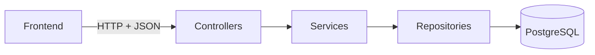

# Arquitetura

Monólito modular em camadas, como pede o briefing. Sem microsserviços.

## Stack

| Item | Escolha | Justificativa |
|---|---|---|
| Java | 21 (LTS) | Exigido pelo briefing |
| Framework | Spring Boot 3.x | Exigido pelo briefing |
| Build | Maven | Configuração simples e conhecida por todo o grupo |
| Persistência | Spring Data JPA / Hibernate | Exigido pelo briefing |
| Banco | PostgreSQL | Tem CHECK, índices únicos e `SELECT ... FOR UPDATE`, que ajudam na candidatura única e no controle de vagas |
| Migrações | Flyway | Schema versionado no Git, igual para todos e com massa de demonstração |
| Segurança | Spring Security + JWT (Bearer) | Frontend separado do backend, sem sessão no servidor. Senhas com BCrypt |
| Validação | Jakarta Bean Validation | Exigido pelo briefing. O frontend também valida para melhorar a experiência |
| Documentação da API | springdoc-openapi (Swagger UI) | Gera a documentação a partir do código |
| Testes | JUnit 5 e Mockito | Foco nas regras críticas e nos fluxos principais |
| Frontend | React + Vite | Componentes reaproveitáveis nas telas de listagem e formulário |
| Mockup | Figma | Gratuito, fácil de exportar em PNG e de compartilhar |
| Ambiente local | Docker Compose | Sobe o PostgreSQL igual para todos |

Pontos ainda em aberto estão em [decisoes.md](decisoes.md).

## Organização do backend

Monólito modular: um pacote por módulo dentro de `br.univille.voluntare` e, dentro de cada módulo, um subpacote por camada. Cada módulo tem só as camadas de que precisa. Não usamos Spring Modulith (D-10).

| Módulo | Responsabilidade | Camadas |
|---|---|---|
| `auth` | Login e emissão do token JWT | controller, service, dto |
| `usuario` | Contas de acesso e papéis | controller, service, repository, dto, entity |
| `voluntario` | Perfil do voluntário e catálogo de habilidades | controller, service, repository, dto, entity |
| `oportunidade` | Oportunidades e habilidades desejadas | controller, service, repository, dto, entity |
| `candidatura` | Candidaturas, aceite, rejeição e controle de vagas | controller, service, repository, dto, entity |
| `participacao` | Presença, horas e cancelamento | controller, service, repository, dto, entity |
| `historico` | Registro das mudanças de status em `historico_status` | service, repository, entity |
| `parametro` | Parâmetros do sistema, como o prazo de devolução da vaga | controller, service, repository, dto, entity |
| `dashboard` | Indicadores do coordenador, calculados por consulta | controller, service, dto |
| `shared` | Erros, configuração e utilitários | config, exception, util |

Regras de negócio ficam nos services. Controllers só recebem a requisição, validam e chamam o service. Entidades não são expostas na API, só DTOs.

O módulo `historico` não tem endpoint próprio. Os services de oportunidade, candidatura e participação chamam o `HistoricoService` sempre que mudam um status, na mesma transação da mudança. Assim, nunca existe mudança sem histórico, nem histórico sem mudança.

## Comunicação entre as camadas

- O frontend chama a API REST em JSON com o token no header `Authorization: Bearer <token>`.
- O backend responde erros em formato padrão: `status`, `mensagem` e lista de `campos` com problema.
- O banco só é acessado pelos repositories.
- CORS liberado apenas para a origem do frontend em desenvolvimento.

## Acesso por perfil

| Perfil | Pode |
|---|---|
| Voluntário | Editar o próprio perfil, ver oportunidades abertas, candidatar-se, cancelar candidatura, ver o próprio histórico |
| Coordenador | Criar e gerenciar as próprias oportunidades, aceitar ou rejeitar candidaturas, registrar presença e horas, ver o dashboard |
| Administrador | Gerenciar usuários e parâmetros básicos |

## Regras críticas

- **Vagas:** ao aceitar uma candidatura, o service trava a linha da oportunidade dentro de uma transação, conta as participações que ocupam vaga e só confirma se houver vaga. Isso evita que dois aceites simultâneos passem do limite.
- **Candidatura única:** garantida no service e por índice único no banco (`oportunidade_id` + `voluntario_id`).
- **Histórico:** nada é apagado fisicamente. Oportunidades, candidaturas e participações mudam de status e cada mudança fica em `historico_status`.

O detalhamento das restrições está em [der/der.md](der/der.md).
