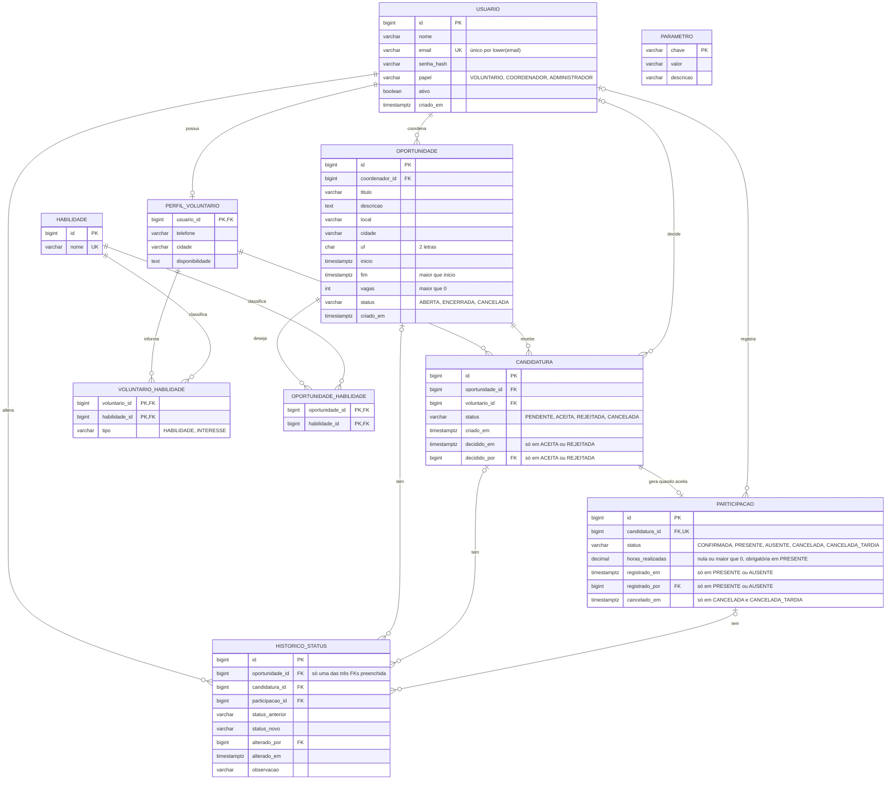

# DER

Modelo inicial do Voluntare. Diagrama em Mermaid (o GitHub renderiza direto). O código-fonte do diagrama está em `der.mmd` e a imagem em `der.png`.

Cardinalidades principais:

- Um usuário voluntário tem um perfil (1 para 0..1).
- Um coordenador cria várias oportunidades (1 para N).
- Uma oportunidade recebe várias candidaturas (1 para N).
- Um voluntário envia várias candidaturas (1 para N).
- Uma candidatura aceita gera uma participação (1 para 0..1).
- Voluntário e habilidade, e oportunidade e habilidade, são N para N por tabelas de junção.
- Um usuário decide candidaturas, registra participações e altera status (1 para N em cada caso). Quem faz a ação fica em `decidido_por`, `registrado_por` e `alterado_por`.
- Cada linha de `historico_status` pertence a uma única oportunidade, candidatura ou participação.

## Dicionário resumido

| Entidade | Descrição |
|---|---|
| `usuario` | Conta de acesso. O campo `papel` define o que a pessoa pode fazer |
| `perfil_voluntario` | Dados extras do voluntário. Usa o mesmo id do usuário |
| `habilidade` | Catálogo de habilidades e interesses, usado no perfil e nas oportunidades |
| `voluntario_habilidade` | Liga voluntário e habilidade. O campo `tipo` diz se é habilidade ou interesse daquela pessoa |
| `oportunidade` | Ação de voluntariado com início, fim, local, vagas e status |
| `candidatura` | Pedido do voluntário para participar de uma oportunidade |
| `participacao` | Confirmação do voluntário e resultado (presença e horas) |
| `historico_status` | Registro de cada mudança de status, com quem fez e quando |
| `parametro` | Configurações básicas, como o prazo para devolver a vaga |

## Decisões de modelagem

- **Candidatura e participação são separadas.** A candidatura é o pedido. A participação só existe depois do aceite e guarda presença e horas. Isso deixa clara a regra 4.
- **Onde o voluntário cancela.** Antes do aceite, ele cancela a candidatura (`PENDENTE` para `CANCELADA`). Depois do aceite, a candidatura continua `ACEITA` e o cancelamento é feito na participação (`CANCELADA` ou `CANCELADA_TARDIA`). Assim cada tipo de cancelamento tem um lugar só.
- **Vagas restantes e "preenchida" não são colunas.** Vêm da contagem de participações que ocupam vaga (todas menos `CANCELADA`). Assim não existe número para ficar desatualizado.
- **Cancelamento da participação tem dois status.** `CANCELADA` devolve a vaga. `CANCELADA_TARDIA` não devolve, por ter passado do prazo de substituição.
- **`historico_status` tem uma FK para cada entidade.** Em vez de `entidade` e `entidade_id` sem chave estrangeira, a tabela tem `oportunidade_id`, `candidatura_id` e `participacao_id`. Um CHECK exige que só uma delas esteja preenchida. Assim o banco garante que o registro existe, e a linha do tempo continua numa tabela só, sem juntar três.
- **Fonte da verdade da auditoria.** `historico_status` é a fonte oficial de quem mudou o quê e quando. Os campos `decidido_em`/`decidido_por` e `registrado_em`/`registrado_por` são cópias para leitura rápida, gravadas na mesma transação do histórico.
- **Tipo na ligação com o voluntário.** `tipo` (habilidade ou interesse) fica em `voluntario_habilidade`. Assim a mesma habilidade pode ser habilidade de uma pessoa e interesse de outra. A oportunidade só pede a habilidade, sem tipo.
- **Início e fim.** A oportunidade continua sendo uma única ocorrência (Q-07), agora com `inicio` e `fim`. O fim marca quando a presença pode ser registrada e a duração serve para validar as horas.
- **Local.** `local` guarda o endereço em texto e `cidade` e `uf` permitem filtrar as oportunidades por cidade e UF.
- **Datas com fuso.** Todos os campos de data e hora usam `timestamptz`.
- **Nomes.** Campos de data seguem o padrão `criado_em`, `decidido_em`, `registrado_em`, `cancelado_em` e `alterado_em`.
- **Não existe entidade de organização.** Não consta nos conceitos do briefing. Está como dúvida Q-02 em [decisoes.md](../decisoes.md).
- **Disponibilidade continua em texto.** Tabela com dia e turno fica para uma próxima etapa, caso o PO queira filtrar por disponibilidade.

## Restrições no banco

| Tabela | Restrição |
|---|---|
| `usuario` | `email` único sem diferenciar maiúsculas (índice único em `lower(email)`) |
| `usuario` | `papel` limitado por CHECK a `VOLUNTARIO`, `COORDENADOR`, `ADMINISTRADOR` |
| `habilidade` | `nome` único |
| `voluntario_habilidade` | `tipo` limitado por CHECK a `HABILIDADE`, `INTERESSE` |
| `oportunidade` | `vagas > 0` |
| `oportunidade` | `fim > inicio` |
| `oportunidade` | `status` limitado por CHECK a `ABERTA`, `ENCERRADA`, `CANCELADA` |
| `candidatura` | Único em (`oportunidade_id`, `voluntario_id`) |
| `candidatura` | `status` limitado por CHECK a `PENDENTE`, `ACEITA`, `REJEITADA`, `CANCELADA` |
| `candidatura` | `decidido_em` e `decidido_por` preenchidos se `status` for `ACEITA` ou `REJEITADA`, e nulos nos demais |
| `participacao` | `candidatura_id` único e obrigatório |
| `participacao` | `status` limitado por CHECK a `CONFIRMADA`, `PRESENTE`, `AUSENTE`, `CANCELADA`, `CANCELADA_TARDIA` |
| `participacao` | `horas_realizadas` nula ou maior que 0, e obrigatória quando `status` for `PRESENTE` |
| `participacao` | `cancelado_em` obrigatório quando `status` for `CANCELADA` ou `CANCELADA_TARDIA`, e nulo nos demais |
| `participacao` | `registrado_em` e `registrado_por` preenchidos quando `status` for `PRESENTE` ou `AUSENTE`, e nulos nos demais |
| `historico_status` | Exatamente uma entre `oportunidade_id`, `candidatura_id` e `participacao_id` preenchida (`num_nonnulls(...) = 1`) |
| Todas | Chaves estrangeiras com `ON DELETE RESTRICT`. Não há exclusão física de oportunidade, candidatura ou participação |

## Regras validadas no service

O banco não consegue garantir estas regras sozinhas. Elas ficam no service, dentro de transação, como pede o briefing. Optamos por service e não por trigger para manter a regra em um lugar só e fácil de testar (decisão D-07).

| Regra | Como é garantida |
|---|---|
| Confirmados não passam de `vagas` | Ao aceitar, o service trava a linha da oportunidade (`SELECT ... FOR UPDATE`), conta as participações que ocupam vaga e só confirma se houver vaga |
| Participação só nasce de candidatura `ACEITA` | A participação é criada pelo service na mesma transação do aceite. Não existe outro caminho para criá-la |
| Só um usuário com papel `COORDENADOR` é dono de oportunidade e decide candidatura | O service confere o papel ao criar a oportunidade (`coordenador_id`) e ao gravar `decidido_por`, e confere que a oportunidade é dele |
| Só o coordenador da oportunidade registra presença e horas | O service confere o papel e se a oportunidade é dele antes de gravar `registrado_por` |
| Candidatura só em oportunidade `ABERTA` | Verificado no service antes de criar a candidatura |
| Aceitar ou rejeitar só em oportunidade `ABERTA` | Verificado no service antes de decidir |
| `vagas` não pode ficar abaixo dos confirmados | Ao editar a oportunidade, o service compara com a contagem de participações que ocupam vaga |
| Mudanças de status seguem o fluxo | Candidatura: `PENDENTE` para `ACEITA`, `REJEITADA` ou `CANCELADA`. Participação: `CONFIRMADA` para `PRESENTE`, `AUSENTE`, `CANCELADA` ou `CANCELADA_TARDIA`. Oportunidade: `ABERTA` para `ENCERRADA` ou `CANCELADA`. Os demais são finais |
| Presença e horas só depois de `fim` e só em participação `CONFIRMADA` | O service compara com o `fim` da oportunidade e com o status da participação |
| Horas não passam da duração (proposta, a validar com o PO) | O service compara `horas_realizadas` com `fim - inicio` |
| Devolução de vaga conforme o prazo | O service compara o momento do cancelamento com o prazo do `parametro`, contado antes do `inicio`, e define `CANCELADA` ou `CANCELADA_TARDIA` |
| Toda mudança de status grava em `historico_status` | O service grava o histórico na mesma transação da mudança |

## Índices

Além dos índices criados pelas chaves primárias e pelas restrições únicas:

| Tabela | Índice | Para que serve |
|---|---|---|
| `oportunidade` | `coordenador_id` | Listar as oportunidades do coordenador |
| `oportunidade` | (`status`, `inicio`) | Listagem e filtro de oportunidades abertas |
| `candidatura` | `voluntario_id` | Listar as candidaturas do voluntário. O lado de `oportunidade_id` já é coberto pelo índice único |
| `candidatura` | `decidido_por` | FK para `usuario` |
| `participacao` | `registrado_por` | FK para `usuario` |
| `voluntario_habilidade` | `habilidade_id` | Lado inverso da chave composta (voluntários com uma habilidade) |
| `oportunidade_habilidade` | `habilidade_id` | Lado inverso da chave composta (oportunidades que pedem uma habilidade) |
| `historico_status` | `oportunidade_id`, `candidatura_id`, `participacao_id` (parciais, onde não são nulos) | Buscar o histórico de um registro |
| `historico_status` | `alterado_por` | FK para `usuario` |

## Conferência com as regras de negócio

| Regra do briefing | Como o modelo atende |
|---|---|
| 1. Sem candidatura duplicada | Índice único em (`oportunidade_id`, `voluntario_id`) |
| 2. Oportunidade encerrada ou cancelada não aceita candidatura | `oportunidade.status`, verificado no service |
| 3. Confirmados não passam das vagas | Contagem de `participacao` contra `oportunidade.vagas`, com lock |
| 4. Presença e horas só para candidatura aceita | `participacao` só nasce de candidatura `ACEITA` |
| 5. Horas maiores que zero e depois da data | CHECK no banco (`horas_realizadas` nula ou maior que 0, obrigatória em `PRESENTE`) e validação do `fim` e da duração no service |
| 6. Cancelamento devolve a vaga se houver tempo | `CANCELADA` e `CANCELADA_TARDIA` na participação, prazo em `parametro` |
| 7. Histórico permanece após encerrar | Sem exclusão física e `historico_status` independente |

Dashboard do coordenador, calculado por consulta:

- **Abertas:** status `ABERTA` e vagas ocupadas menores que `vagas`
- **Preenchidas:** status `ABERTA` e vagas ocupadas iguais a `vagas`
- **Encerradas:** status `ENCERRADA`

Participações, também por consulta:

- Quantidade por status (`CONFIRMADA`, `PRESENTE`, `AUSENTE`, canceladas)
- Soma de `horas_realizadas` das participações `PRESENTE`
