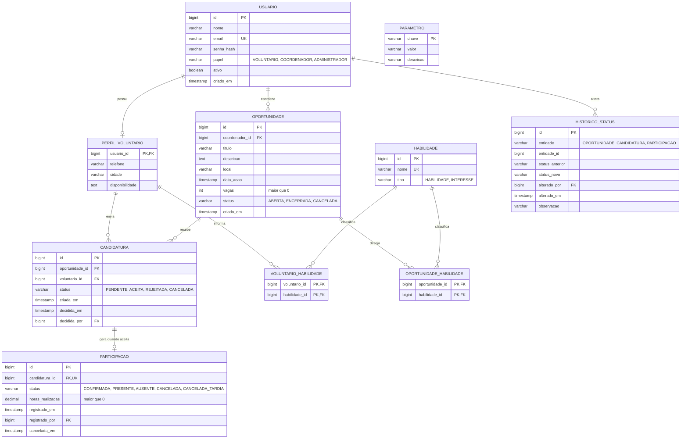

# DER

Modelo inicial do Voluntare. Diagrama em Mermaid (o GitHub renderiza direto). O código-fonte do diagrama está em `der.mmd`.

Cardinalidades principais:

- Um usuário voluntário tem um perfil (1 para 0..1).
- Um coordenador cria várias oportunidades (1 para N).
- Uma oportunidade recebe várias candidaturas (1 para N).
- Um voluntário envia várias candidaturas (1 para N).
- Uma candidatura aceita gera uma participação (1 para 0..1).
- Voluntário e habilidade, e oportunidade e habilidade, são N para N por tabelas de junção.

## Dicionário resumido

| Entidade | Descrição |
|---|---|
| `usuario` | Conta de acesso. O campo `papel` define o que a pessoa pode fazer |
| `perfil_voluntario` | Dados extras do voluntário. Usa o mesmo id do usuário |
| `habilidade` | Catálogo de habilidades e interesses, usado no perfil e nas oportunidades |
| `oportunidade` | Ação de voluntariado com data, local, vagas e status |
| `candidatura` | Pedido do voluntário para participar de uma oportunidade |
| `participacao` | Confirmação do voluntário e resultado (presença e horas) |
| `historico_status` | Registro de cada mudança de status, com quem fez e quando |
| `parametro` | Configurações básicas, como o prazo para devolver a vaga |

## Decisões de modelagem

- **Candidatura e participação são separadas.** A candidatura é o pedido. A participação só existe depois do aceite e guarda presença e horas. Isso deixa clara a regra 4.
- **Vagas restantes e "preenchida" não são colunas.** Vêm da contagem de participações que ocupam vaga (todas menos `CANCELADA`). Assim não existe número para ficar desatualizado.
- **Cancelamento tem dois status.** `CANCELADA` devolve a vaga. `CANCELADA_TARDIA` não devolve, por ter passado do prazo de substituição.
- **`historico_status` é uma tabela única.** `entidade` e `entidade_id` apontam para o registro alterado, sem chave estrangeira. É mais simples que uma tabela por entidade, mas o banco não garante a existência do registro. O service garante.
- **Não existe entidade de organização.** Não consta nos conceitos do briefing. Está como dúvida Q-02 em [decisoes.md](../decisoes.md).

## Restrições

| Onde | Restrição |
|---|---|
| Banco | `usuario.email` único |
| Banco | `habilidade.nome` único |
| Banco | `candidatura`: único em (`oportunidade_id`, `voluntario_id`) |
| Banco | `participacao.candidatura_id` único e obrigatório |
| Banco | `oportunidade.vagas > 0` |
| Banco | `participacao.horas_realizadas` nula ou maior que 0 |
| Banco | Chaves estrangeiras com `ON DELETE RESTRICT`. Não há exclusão física de oportunidade, candidatura ou participação |
| Banco | Valores de status limitados por CHECK |
| Service | Confirmados não podem passar de `vagas` (transação com lock na oportunidade) |
| Service | Candidatura só em oportunidade `ABERTA` |
| Service | Participação só é criada a partir de candidatura `ACEITA` |
| Service | Presença e horas só depois de `data_acao` e só para participação confirmada |
| Service | Devolução de vaga conforme o prazo do `parametro` |
| Service | Toda mudança de status grava em `historico_status` |

## Conferência com as regras de negócio

| Regra do briefing | Como o modelo atende |
|---|---|
| 1. Sem candidatura duplicada | Índice único em (`oportunidade_id`, `voluntario_id`) |
| 2. Oportunidade encerrada ou cancelada não aceita candidatura | `oportunidade.status`, verificado no service |
| 3. Confirmados não passam das vagas | Contagem de `participacao` contra `oportunidade.vagas`, com lock |
| 4. Presença e horas só para candidatura aceita | `participacao` só nasce de candidatura `ACEITA` |
| 5. Horas maiores que zero e depois da data | CHECK no banco e validação de `data_acao` no service |
| 6. Cancelamento devolve a vaga se houver tempo | `CANCELADA` e `CANCELADA_TARDIA`, prazo em `parametro` |
| 7. Histórico permanece após encerrar | Sem exclusão física e `historico_status` independente |

Dashboard do coordenador, calculado por consulta:

- **Abertas:** status `ABERTA` e vagas ocupadas menores que `vagas`
- **Preenchidas:** status `ABERTA` e vagas ocupadas iguais a `vagas`
- **Encerradas:** status `ENCERRADA`
