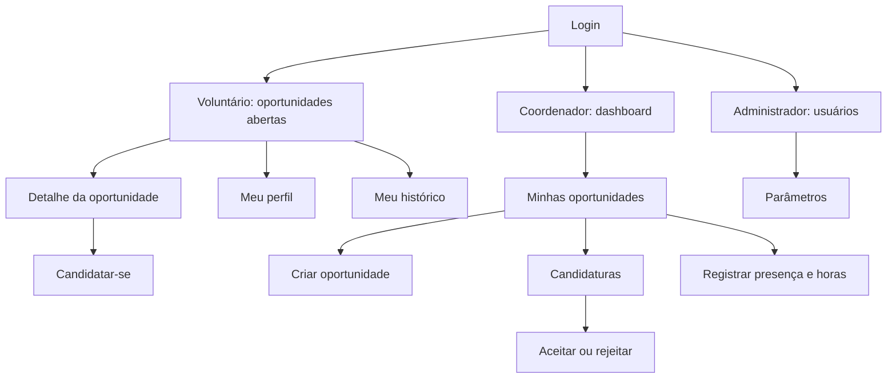

# Mockups e fluxo de telas

Os mockups de baixa fidelidade serão feitos no Figma. Exportar os PNGs para esta pasta e colocar o link do arquivo abaixo.

Link do Figma: _a preencher_

## Telas por perfil

| Perfil | Telas |
|---|---|
| Todos | Login, cadastro de voluntário |
| Voluntário | Oportunidades abertas (com filtro), detalhe da oportunidade, meu perfil, minhas candidaturas, meu histórico |
| Coordenador | Dashboard, minhas oportunidades, criar/editar oportunidade, candidaturas da oportunidade, registro de presença e horas |
| Administrador | Usuários, parâmetros |

## Mapa de navegação

## Fluxo completo para demonstrar

1. Coordenador cria uma oportunidade com vagas limitadas.
2. Voluntário vê a oportunidade e se candidata.
3. Coordenador aceita a candidatura.
4. Depois da data, coordenador registra presença e horas.
5. Voluntário vê a participação no histórico.

## Identidade visual inicial (proposta)

- Nome: Voluntare
- Cor principal: verde (`#2E7D32`)
- Cor de apoio: azul escuro (`#1F4E79`)
- Fundo claro, textos escuros
- Tipografia: Inter (ou a fonte padrão do sistema)
- Botões e campos simples, sem imagens decorativas

## Fora do escopo

Chat, IA, certificados, gamificação, redes sociais, app mobile e doações não aparecem nos mockups.
